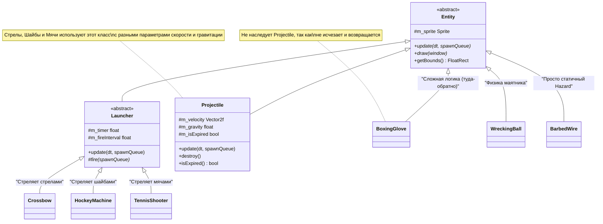

```mermaid
classDiagram
    %% Базовый уровень
    class Entity {
        <<abstract>>
        +update(dt, spawnQueue)*
        +draw(window)*
        +getBounds() FloatRect
        #m_sprite Sprite
    }

    %% Ветка лаунчеров (Пусковые установки)
    Entity <|-- Launcher
    class Launcher {
        <<abstract>>
        +update(dt, spawnQueue)
        #fire(spawnQueue)*
        #m_timer float
        #m_fireInterval float
    }

    Launcher <|-- Crossbow : "Стреляет стрелами"
    Launcher <|-- HockeyMachine : "Стреляет шайбами"
    Launcher <|-- TennisShooter : "Стреляет мячами"

    %% Ветка снарядов
    Entity <|-- Projectile
    class Projectile {
        +update(dt, spawnQueue)
        +destroy()
        +isExpired() bool
        #m_velocity Vector2f
        #m_gravity float
        #m_isExpired bool
    }

    %% Особые случаи
    Entity <|-- BoxingGlove : "Сложная логика (туда-обратно)"
    Entity <|-- WreckingBall : "Физика маятника"
    Entity <|-- BarbedWire : "Просто статичный Hazard"

    note for Projectile "Стрелы, Шайбы и Мячи используют этот класс\nс разными параметрами скорости и гравитации"
    note for BoxingGlove "Не наследует Projectile, так как\nне исчезает и возвращается"
```